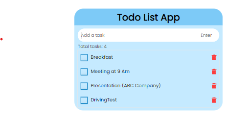

A todo list app

User can add, check after completed and delete a particular task.

User can delete the task by clicking on the delete icon.

View of the Todo List App...

## You can visit: https://todolistninjas.netlify.app/

### General steps to follow when creating a project

- Thinking about the UI
- Functionality
	- Add a TODO
	- Delete a TODO
	- check task
	- total items count
- Data
	- tasks - an array
	- task - {done, text, id}
- Functions (in code)
	- addTodo
	- deleteTodo
	- checkTodo
	- renderTodosList
	- showNotification
# Todo-List-App
